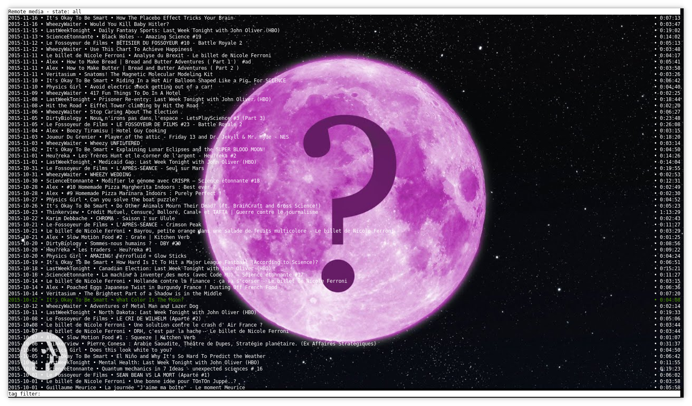

termipod - Podcasts and Youtube in your terminal
================================================

termipod is a *curses* application written in Python3 to manage your podcasts and your youtube
channels in your terminal.

With it, you can:

* Handle channel/user/playlist youtube pages
* Handle RSS feeds with media
* Mark media as read/unread/skipped
* Download media
* Automatically download new media matching a pattern
* Play media with *mpv*, mark automatically as read if entirely played
* Create sub-channel based on regex (called mask)
* Add only media (with disabled channel)
* Display thumbnails (in urxvt terminal with pixbuf support)
* Create m3u playlists
* Search in your channel/media list
* Run local http server to stream m3u playlists and media (requires Python twisted module)
* Tag media and channels, filter media
* Export channels to file
* Customizable key bindings

Youtube channels are handled by *youtube_dl* for the first import to get all videos, but then,
for efficiency purpose, by *feedparser* reading the RSS feed provided by Google.

## User Interface

There are some screenshots from different situations.

### Media and channel lists

    
     
    List of media with main information

 

    
     
    List of channels with main information

 

    
     
    List of channels with key binding list

 

    
     
    List of channels with detailed information

 

    
     
    List of media with detailed information

 

    
     
    List of media with description

 

### Thumbnails

    
     
    Small thumbnail in media list

 

    
     
    Fullscreen thumbnail in media list

 

    
     
    Fullscreen thumbnail in channel list

 

### mpv interface

    
     
    mpv window launched by termipod

 

    
     
    mpv window with help listing keys added by termipod

 

### Tags and categories

    
     
    Media list with only "watch later" media

 

    
     
    Channel list restricted to *favorites* and *science*

 

    
     
    Set channel categories

 

### Streaming server

    
     
    View and play your downloaded media or built playlists from a web browser

 

## Requirements

* appdirs
* feedparser
* mpv
* youtube_dl

## Installation

You can install it with pip:

    pip install termipod

To install last version from master, simply clone it and run in the repository directory:

    pip install .

## Execution

    # To open UI
    termipod

    # To show help
    termipod --help

    # To add a new channel from command line and automatically download new videos
    termipod --add http://radiofrance-podcast.net/podcast09/rss_14257.xml --add-opts "auto=.*"

## License

termipod is free software; you can redistribute it and/or modify
it under the terms of the GNU General Public License as published by
the Free Software Foundation; either version 3 of the License, or
(at your option) any later version.

termipod is distributed in the hope that it will be useful,
but WITHOUT ANY WARRANTY; without even the implied warranty of
MERCHANTABILITY or FITNESS FOR A PARTICULAR PURPOSE.  See the
GNU General Public License for more details.

You should have received a copy of the GNU General Public License
along with this program.  If not, see
[http://www.gnu.org/licenses/](http://www.gnu.org/licenses/).
